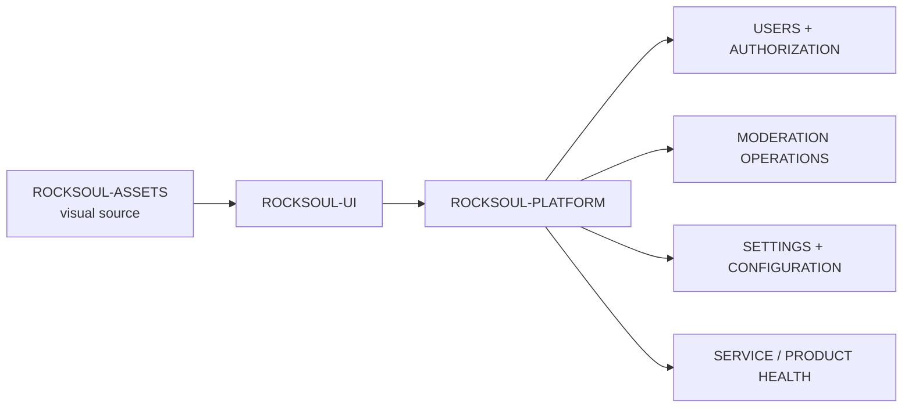

<div align="center">


# ROCKSOUL PLATFORM

## **THE ADMINISTRATION LAYER**

### **OPERATE THE PRODUCT. GOVERN ACCESS. KEEP THE SYSTEM HEALTHY.**

Internal administration and product-operations surface for the **MoonWitness × Rocksoul** ecosystem: users, authorization, moderation operations, settings, service health, and governed operational workflows.


[Design Source](https://github.com/bjo163/rocksoul-assets) · [UI System](https://github.com/bjo163/rocksoul-ui) · [Community](https://github.com/bjo163/rocksoul-community) · [Console](https://github.com/bjo163/rocksoul-crayon)

</div>

---

> **PLATFORM governs product operations. CRAYON operates research workflows. The intelligence repositories own research truth.**

## Product role



The canonical baseline is `rocksoul-assets` screen **15 — Platform Admin**, extended by v2 authorization, settings, dashboard, notification, and system-state surfaces.

## Platform surfaces

```text
ADMIN DASHBOARD
USERS + ROLES
AUTHORIZATION
MODERATION OPERATIONS
SETTINGS
SERVICE STATUS
NOTIFICATIONS
AUDIT / OPERATIONAL LOGS
SYSTEM STATES
```

## Platform vs Console

| | `rocksoul-platform` | `rocksoul-crayon` |
|---|---|---|
| Primary role | product administration | research/operator console |
| Users / roles | owns operational UX | consumes authorization context |
| Moderation | community/product operations | research review workflow |
| Research domains | references only | operates across all five |
| Canonical research | never owns | never silently owns |

## Ecosystem contract

```text
ASSETS      → visual truth
UI          → reusable implementation grammar
WEB         → public observatory
COMMUNITY   → participation
PLATFORM    → administration
CRAYON      → research operations

MFTL        → STORY
LEGEND      → EVENT
SUPERHERO   → PERSON
RGBL        → TEXT
AWS         → LAW
```

## Visual contract

- platform/admin surfaces use the clean, dense operational treatment defined in assets;
- use `@rocksoul/ui` shared shell, status, tables, forms, authorization, and system states;
- do not introduce a parallel navigation or token system;
- status must never be color-only;
- destructive and privileged operations require explicit affordances and auditability;
- product administration ≠ research adjudication.

---

<div align="center">


## **GOVERN THE PRODUCT. PRESERVE THE BOUNDARIES.**

`PLATFORM / MoonWitness × Rocksoul`

</div>
